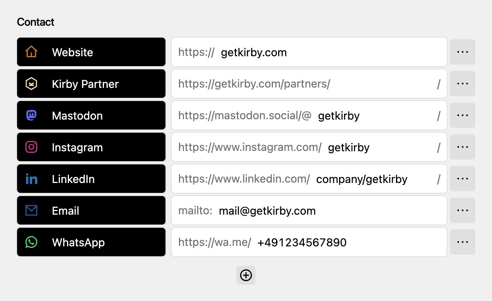
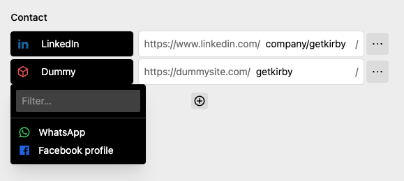
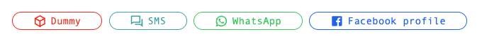

# Plain Contact Field Plugin for Kirby CMS




## Installation

**Manually**

[Download](https://github.com/plain-solutions-gmbh/kirby-contact) and unzip the content into your plugin folder: `/site/plugins/`

**With Composer**

```bash
composer require getplain/kirby-contact
```

## Example



```yaml
contact_example:
  label: Contact
  type: contact

  # Make items draggable (default: false)
  sortable: true

  # Save options in value (default: false)
  # (+) More performance and stability 
  # (-) Options freeze after save
  saveOptions: true

  # Additional fields (optional)
  # Shown in drawer [ ••• More ]
  fields:
    title:
      type: text

  # Set options (optional)
  # Taken from option('plain.contact.types')
  # See: https://getkirby.com/docs/guide/configuration
  options:

    # Select option from plain.contact.types
    linkedin: true
    whatsapp: true

    # Extends existing option
    facebook:
      label: Facebook profile

    # Create own option
    dummy:
      # See: https://getkirby.com/docs/reference/panel/icons
      icon: box
      color: red
      # See: https://getkirby.com/docs/reference/system/validators
      validate: alpha
      output:
        # Contact link: $field->toContact();
        contact: "https://dummysite.com/{value}/"
        # Share link: $page->toShare();
        share: "https://dummysite.com/share/{url}/"
        # Custom output <?= $contact->custom_title() ?>
        custom_title: "{title}"
```

## Options

All available items are stored in the option `plain.contact.types`. It can be modified by the option property of the field.

## Output

There are two ways to output the contact data.

**1. Output share buttons from page (without a field)**


You can output share buttons for the current page: 

```php
<?= $page->toShare() ?>
```

*Parameters:*
1. Filter (array): A list of items
2. Snippet (Default: `share`)
3. Optional placeholders
   

> Snippet are located in `/site/snippets/contact/share` *(copy it from `/site/plugins/kirby-contact/snippets/contact/share`)*

**2. Contact buttons (From Field)**





```php
<?= $page->->contact_example()->toShare() ?>
```

*Parameters:*
1. Snippet (Default: `contact`)
2. Optional placeholders


> Snippet are located in `/site/snippets/contact/contact` *(copy it from `/site/plugins/kirby-contact/snippets/contact/contact`)*