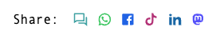

# Plain Contact Plugin for Kirby CMS


You can use this plugin in two ways:

☝️ Create contact buttons and use it on a page.<br />✌️ Let your visitors share a page with their community.

## Installation

**Manually**

[Download](https://github.com/plain-solutions-gmbh/kirby-contact) and unzip the content into your plugin folder: `/site/plugins/`

**With Composer**

```bash
composer require getplain/kirby-contact
```

## Contact field


### Blueprints

```yaml
contact_fields:
  label: Contact
  type: contact

  # Make items draggable (default: false)
  sortable: true

  # Save options in value (default: false)
  # (+) More performance and stability 
  # (-) Options freeze after save
  saveOptions: true

  # Additional fields (optional)
  # Shown in drawer [ ••• More ]
  fields:
    title:
      type: text

  # Set options (optional)
  # Taken from option('plain.contact.types')
  # See: https://getkirby.com/docs/guide/configuration
  options:

    # Select option from plain.contact.types
    linkedin: true
    whatsapp: true

    # Extends existing option
    facebook:
      label: Facebook profile

    # Create own option
    dummy:
      # See: https://getkirby.com/docs/reference/panel/icons
      icon: box
      color: red
      # See: https://getkirby.com/docs/reference/system/validators
      validate: alpha
      output:
        # Contact link: $field->toContact();
        contact: "https://dummysite.com/{value}/"
        # Share link: $page->toShare();
        share: "https://dummysite.com/share/{url}/"
        # Custom output <?= $contact->custom_title() ?>
        custom_title: "{title}"
```


### Output


```php
<?= $page->contact_fields()->toContact() ?>
```

*Parameters:*
1. Snippet (Default: `contact`)
2. Optional placeholders

> Snippet are located in `/site/snippets/contact/` *(copy it from `/site/plugins/kirby-contact/snippets/contact/`)*


## Share buttons



You can output share buttons for the current page: 

```php
<?= $page->toShare() ?>
```

*Parameters:*
1. Filter (array): A list of items (required)
2. Snippet (Default: `share`)
3. Optional placeholders


> By default following share buttons are available: sms, whatsapp, facebook, tiktok, linkedin, mastodon.<br />
> For more share buttons use options (next chapter).


> Snippet are located in `/site/snippets/contact/` *(copy it from `/site/plugins/kirby-contact/snippets/contact/`)*


## Options

All available types are stored in the option `plain.contact.types`. It can be modified by the option property of the field. ([See list of default types](https://raw.githubusercontent.com/plain-solutions-gmbh/kirby-contact/refs/heads/main/autoload/options.php))

_Example (site/config/config.php):_
```php
'plain.contact.types' => [
    'default_type' => [
        'icon'      => 'box',
        'label'      => [ 'en' => 'Custom Service' ],
        'color' => '#5828B8',
        'output'    => [
            'contact'   => 'https://example.com/contact/{value}',
            'share'     => 'https://example.com/share/{url}'
        ]
    ]
];
```
